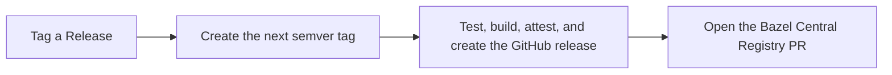

# Releasing

The normal release flow starts from `main` and chooses the next version from
Conventional Commits.



## Normal release

Before starting, confirm that CI and Verify Hooks are green on `main`, no tag or
release workflow is already running, and the latest release is the one you
expect. `BCR_PUBLISH_TOKEN` must belong to an account that can push to
`formatjs/bazel-central-registry`. It must be a Classic PAT with `repo` and
`workflow` scopes; fine-grained PATs cannot open the pull request against the
public upstream registry.

```sh
gh run list \
  --repo formatjs/rules_formatjs \
  --workflow ci.yaml \
  --branch main \
  --limit 1

gh run list \
  --repo formatjs/rules_formatjs \
  --workflow verify-hooks.yml \
  --branch main \
  --limit 1

gh run list --repo formatjs/rules_formatjs --workflow tag.yaml --limit 5
gh release list --repo formatjs/rules_formatjs --limit 5
```

Dispatch the tag workflow. It has no inputs.

```sh
gh workflow run tag.yaml --repo formatjs/rules_formatjs --ref main
```

The workflow uses `smlx/ccv` to inspect commits since the latest release. A
`fix` normally produces a patch, a `feat` produces a minor, and a breaking
change produces a major. Other commit types might not create a release.

Manual dispatch bypasses the two-week guard used by the scheduled run. Do not
push a tag or choose a version manually for a normal patch or minor release.

Find and watch the dispatched run:

```sh
gh run list \
  --repo formatjs/rules_formatjs \
  --workflow tag.yaml \
  --event workflow_dispatch \
  --limit 1

gh run watch RUN_ID --repo formatjs/rules_formatjs --exit-status
```

Completion means all of the following are true:

- the new tag points at the intended `main` commit;
- the GitHub release exists with the source and docs archives;
- release attestations were created;
- the publish job opened or updated the BCR PR.

```sh
gh release view TAG --repo formatjs/rules_formatjs
```

## Major releases

The tag workflow intentionally skips the release and BCR jobs when it computes
a major version. It may still create the tag. Confirm the version and tag before
continuing, then release that existing tag explicitly:

```sh
gh workflow run release.yaml \
  --repo formatjs/rules_formatjs \
  --ref main \
  -f tag_name=TAG
```

## Recovery

Use the narrower workflows only when resuming an existing release:

- If the tag exists but the GitHub release does not, dispatch `release.yaml`
  with that tag.
- If the GitHub release exists but BCR publication failed, dispatch
  `publish.yaml` with that tag.
- If the BCR push reports `Invalid username or token`, rotate
  `BCR_PUBLISH_TOKEN` with a valid Classic PAT that has `repo` and `workflow`
  scopes, then retry `publish.yaml`. Do not rerun the tag or release workflow.

Set or rotate the repository secret interactively so the token is not written
to shell history:

```sh
gh secret set BCR_PUBLISH_TOKEN --repo formatjs/rules_formatjs
```

```sh
gh workflow run publish.yaml \
  --repo formatjs/rules_formatjs \
  --ref main \
  -f tag_name=TAG
```

Do not use either recovery workflow to invent a new version. Do not set the
version in `MODULE.bazel`; the BCR publisher patches it in the registry PR.
